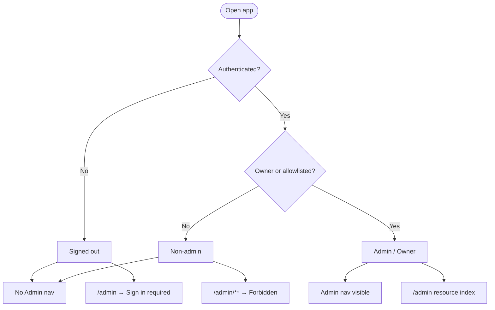
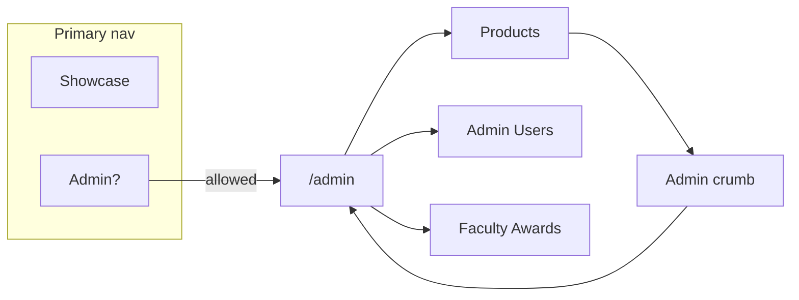
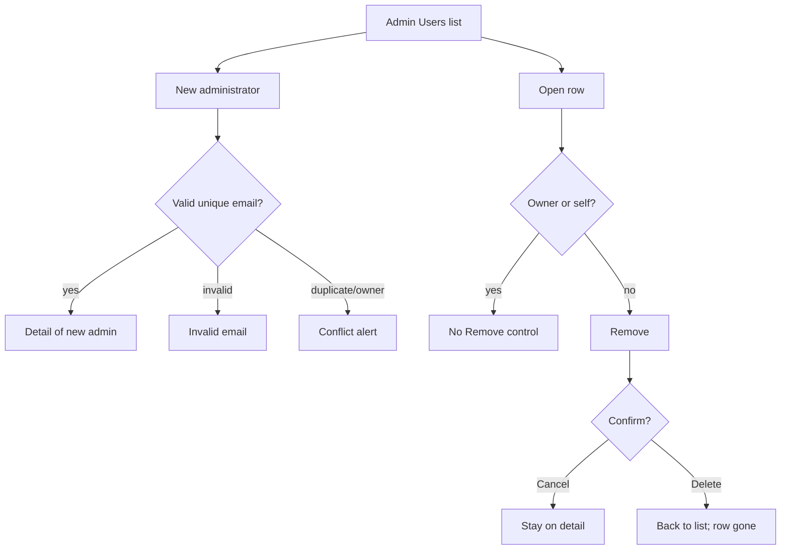

# Admin UX User-Story Plan

Review lens: walk the admin experience as concrete actor stories, then prove each story with Playwright E2E (reuse existing tests where they already cover the story).

Showcase entities (Products, Faculty Awards, Product Categories, etc.) are demo-only under `rayfin/data/showcase/` — not production VPAA domain.

## Actors

| Actor | How they appear in the showcase harness |
| --- | --- |
| **Owner** | Configured owner email (`owner@example.edu`); always allowed |
| **Allowlisted admin** | Email present in Admin Users (`admin@example.edu`) |
| **Non-admin** | Signed-in email not on allowlist (`guest@example.edu`) |
| **Signed-out** | No identity / session |

## Story map

### A. Access & navigation — “As a user, I want the right doors open”

| ID | Story | Options / steps | Existing E2E | Action |
| --- | --- | --- | --- | --- |
| A1 | As an **owner**, I want to open Admin without an AdminUser row | Open `/admin` | `E2E1…` | keep |
| A2 | As an **admin**, I want an Admin tab in primary nav | Visit `/` while allowed | `E2E-NAV Admin tab…` | keep |
| A3 | As a **non-admin**, I do not want an Admin tab | Switch identity → tab gone | `E2E-NAV Admin tab…` | keep |
| A4 | As a **signed-out** user, I want Sign in on `/admin` and then Admin restored | Sign in CTA | `E2E-NAV Sign in…`, `E2E16-E2E17…` | keep |
| A5 | As a **non-admin**, I want Forbidden on Admin deep links | `/admin`, products, admin-users, faculty-awards | `E2E2…` | **done** (extended) |
| A6 | As an **admin**, I want breadcrumb Admin → resource index | Click `Admin` link in shell | `A6 Admin breadcrumb…` | **done** |

### B. Admin Users — “As an admin, I want to manage who else is an admin”

| ID | Story | Options | Existing E2E | Action |
| --- | --- | --- | --- | --- |
| B1 | List admins; owner shows Owner badge | Open Admin Users | `E2E3…` | keep |
| B2 | Open owner detail; cannot remove owner | Click owner row | `E2E3…` | keep |
| B3 | Add admin by email | New → email → Create | `E2E4-E2E6…` | keep |
| B4 | Newly added admin can use Admin | Switch identity | `E2E4-E2E6…` | keep |
| B5 | Remove another admin (confirm) | Remove → Delete | `E2E4-E2E6…` | keep |
| B6 | Cancel remove keeps the admin | Remove → Cancel | `B6-B7…` | **done** |
| B7 | Viewing **my own** membership hides Remove | Open own detail as allowlisted admin | `B6-B7…` | **done** |
| B8 | Invalid email shows field error | Create with `nope` | `B8-B11…` | **done** |
| B9 | Duplicate email shows Conflict | Create same email twice | `B8-B11…` | **done** |
| B10 | Adding owner email shows Conflict | Create `owner@example.edu` | `B8-B11…` | **done** |
| B11 | Missing member id → Not found | `/admin/admin-users/missing` | `B8-B11…` | **done** |

### C. Products — “As an admin, I want to manage product records”

| ID | Story | Options | Existing E2E | Action |
| --- | --- | --- | --- | --- |
| C1 | Paginate list | Next / Previous | `E2E7-E2E9…` | keep |
| C2 | Sort by Name descending | Click Name twice | `E2E7-E2E9…` | keep |
| C3 | Sort by Name ascending | Click Name once | `C3-C4-C6-C7…` | **done** |
| C4 | Open edit from list row click | Click first row | `C3-C4-C6-C7…` | **done** |
| C5 | Create / validate integer / edit / delete cancel+confirm | Full CRUD | `E2E10-E2E13…` | keep |
| C6 | Required field validation | Create with empty name | `C3-C4-C6-C7…` | **done** |
| C7 | Empty list shows No records | Clear Product seed | `C3-C4-C6-C7…` | **done** |
| C8 | Entity Forbidden on list | `setForbidden(["Product"])` | `E2E14…` | keep |
| C9 | Entity Forbidden on create | Forbidden + open `/new` | `C9 Products forbidden…` | **done** |

### D. Faculty Awards — “As an admin, I want typed CRUD beyond Products”

| ID | Story | Options | Existing E2E | Action |
| --- | --- | --- | --- | --- |
| D1 | Create with enum / boolean / textarea; reload | New → Create → reload | `E2E FacultyAward…` | keep |
| D2 | List shows the created row | After create, visit list | `D2-D4…` | **done** |
| D3 | Edit + Save persists | Change title → Save → reload | `D2-D4…` | **done** |
| D4 | Delete cancel then confirm | Same pattern as Products | `D2-D4…` | **done** |

### E. Shared errors — “As an admin, I want honest failure states”

| ID | Story | Existing E2E | Action |
| --- | --- | --- | --- |
| E1 | Unknown resource list → Not found | `E2E15…` | keep |
| E2 | Missing product id → Not found | `E2E15…` | keep |
| E3 | Unknown resource `/new` → Not found | `E3 unknown resource new…` | **done** |
| E4 | Alphabetical resource index | `E2E16-E2E17…` | keep |

## Out of scope for this E2E pass

- Production Fabric SSO embed (no live Entra in showcase); covered by unit auth tests + authenticity probes.
- Root `authConfigError` display (config miswire; not a happy-path admin story).
- Access `error` / “Something went wrong” gate (requires injecting membership 5xx in UI; unit-covered in `access.test.ts`).

## Verification order

1. Land this plan.
2. Add Playwright cases for every **add** / **extend** row above.
3. Run `npm run test:e2e`; fix product bugs only if a story fails.
4. Update PR.

## Bugs found while verifying stories

| Story | Failure | Fix |
| --- | --- | --- |
| C7 Empty Products list | `data.reset({ Product: [] })` did not persist to sessionStorage; full navigation re-seeded 30 products | Wrap harness `data.reset` with the same persist path as create/update/remove (`src/lib/admin/test/bootstrap.ts`) |
